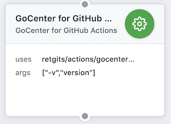

# GitHub Actions for GoCenter

[GoCenter](https://gocenter.io/) is a cloud service that houses Go modules (archives of Go sources for a package and its metadata) and generates Go module metadata, if needed. The official Go client resolves dependencies from a single remote repository set by the GOPROXY environment variable and doesn't support fallback to other module or source repositories. So if a dependency isn't stored in the repository set by GOPROXY, the build fails. So, this GitHub Action contains the [goc](https://github.com/jfrog/goc) utility, which is a wrapper for the go client that correctly builds Go applications using packages from GoCenter and falls back to getting modules from source control systems if they're not found.



## Usage

To use the action simply add the following lines to your `.github/main.workflow`

```hcl
action "GoCenter for GitHub Actionss" {
  uses = "retgits/actions/gocenter@master"
  args = ["build"]
}
```

## Command

The `args` will be prefixed with the `goc` command automaticall (using the [entrypoint](./entrypoint.sh) script), so running `go build` means your cmd should just be `build`

## License

The Dockerfile and associated scripts and documentation in this project are released under the [MIT License](LICENSE).
