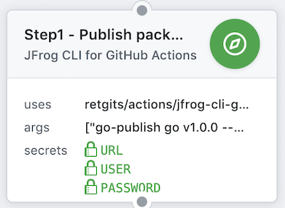

# JFrog CLI for GitHub Actions

The [JFrog CLI](https://jfrog.com/getcli/) is a compact and smart client that provides a simple interface that automates access to JFrog products simplifying your automation scripts and making them more readable and easier to maintain.

And now it is available for GitHub actions too!



## Usage

To use the action simply add the following lines to your `.github/main.workflow`

```hcl
action "JFrog CLI for GitHub Actions" {
  uses = "retgits/actions/jfrog-cli@master"
  secrets = ["USER", "PASSWORD", "URL"]
  args = ["cmd"]
  env = {
    CRED = "username"
  }
}
```

## Environment Variables

You'll need to provide some environment variables to provide the authentication for the JFrog CLI to work. The order listed below is the order of precedence for this GitHub Action.

| Authentication type | Variables to set  |
|---------------------|-------------------|
| Login Credentials   | USER and PASSWORD |
| API Key             | APIKEY            |
| Access Token        | ACCESSTOKEN       |

_These are the variables you want to create as "secrets"_

Other than the authentication, the following environment variables are required for this Action to work:

* **CRED**: The credential type passed in. Valid values are "username", "apikey", and "accesstoken"
* **URL**: The Artifactory URL
* **args**: The command to execute, but without `jfrog rt` (like `build-publish my-build 1`)

## Known limitations

The current version of this Action works only with JFrog Artifactory and doesn't expose any of the other services that JFrog CLI supports (yet)

## License

The Dockerfile and associated scripts and documentation in this project are released under the [MIT License](LICENSE).
